# Thinkful Capstone: Periodic Tables

> Live app is available here:  https://periodic-tables-frontend--as.herokuapp.com/dashboard

A full-stack app built using:
- HTML
- CSS
- JavaScript
- React
- Express
- Knex
- PostgreSQL API

## Available API Endpoints

| URL | Method | Description |
| ---------------- | ----- | ---------------------------------------------------------------- |
| `/reservations?date=YYYY-MM-DD` | GET | Lists all reservations for the date specified |
| `/reservations?mobile_number=999-999-9999` | GET | Lists all reservations for the phone number specified |
| `/reservations` | POST | Creates a new reservation |
| `/reservations/:reservationId` | GET | Reads a reservation by reservation_id |
| `/reservations/:reservationId` | PUT | Updates a reservation by reservation_id |
| `/reservations/:reservationId/status` | PUT | Updates the status of a reservation by reservation_id  |
| `/tables` | GET | Lists all tables |
| `/tables` | POST | Creates a new table |
| `/tables/:table_id/seat` | PUT | Seats a reservation at a table |
| `/tables/:table_id/seat` | DELETE | Finishes an occupied table |

## App Functionality

### Dashboard

- Defaults to displaying a list of booked (or seated) reservations for the current date.  
- Navigation buttons: `Previous Day`, `Today`, & `Next Day` are available for changing the date displayed by the dashboard.
- All tables (free or occupied) are also diplayed here.

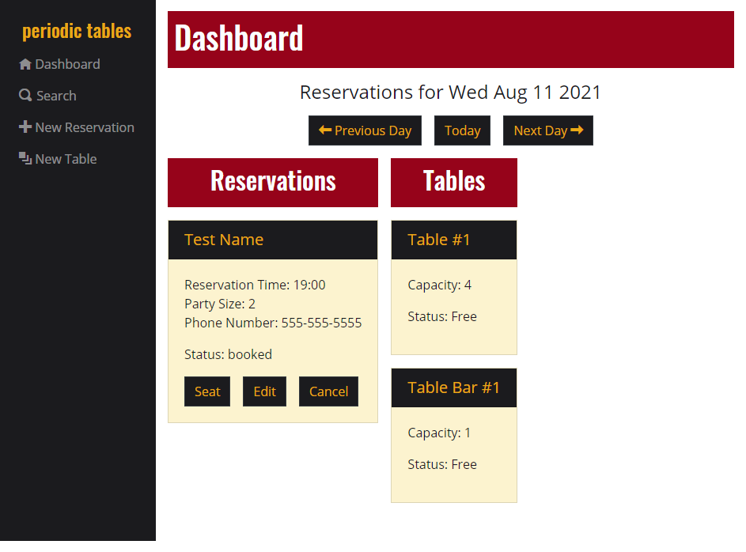

---

### Menu

The menu provides options to:
1. Search for a reservation

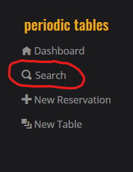

2. Create a new reservation 

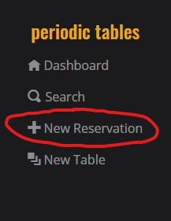

3. Create a new table

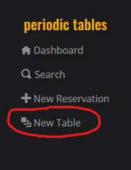

---

### Search

1. Enter the phone number for the reservation.
1. Click `find`.

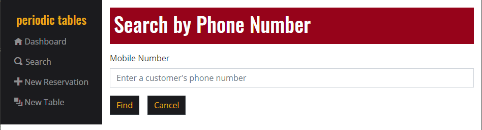

This will display any matching results.

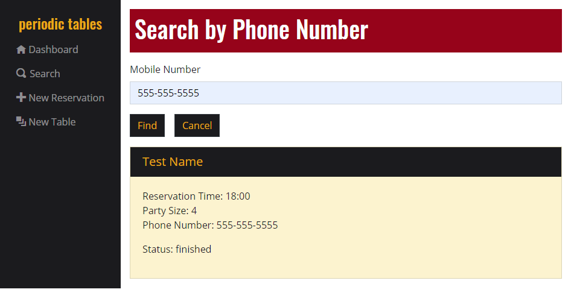

---

### New Reservation

1. Fill out the form with the reservation information.
1. Click `submit`.

---

### New Table

1. Fill out the form with the table information.
1. Click `submit`.

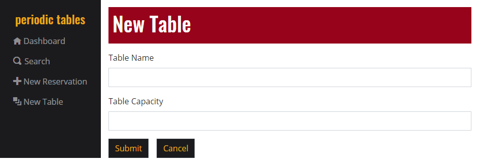

---

### Seating a Reservation

1. Click `seat` on the reservation you'd like to seat.
1. Select a table from the drop-down menu.
1. Click `submit` to seat the reservation at the selected table.

Once a reservation is seated, the reservation status will change from `booked` to `seated`.

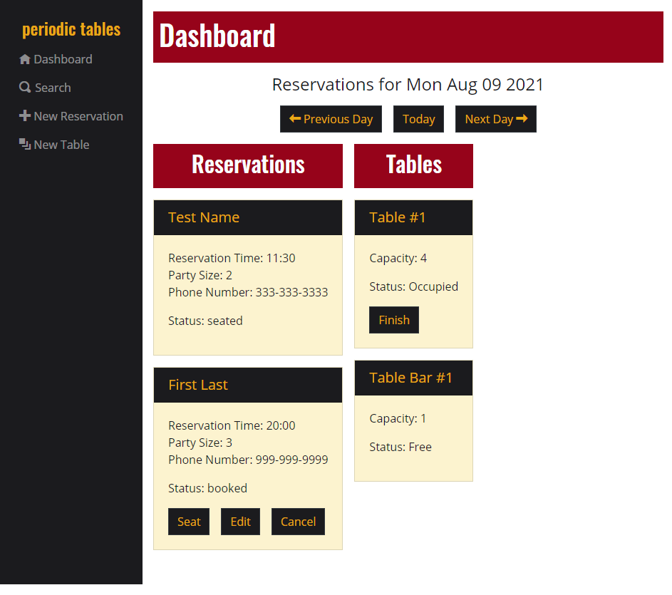

---

### Finishing a Reservation

1. Click `finish` on the table that has finished.
1. Click `OK` on the confirmation window that pops-up.

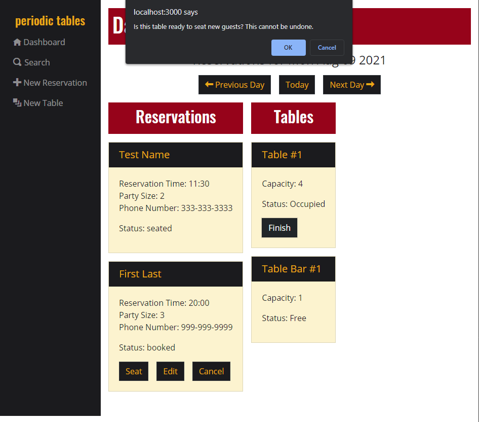

Note: finished reservations no longer display in the dashboard.

---

### Editing a Reservation

1. Click `edit` on the reservation you'd like to edit.
1. Edit any of the reservation information as needed.
1. Click `submit` to save the updated reservation information.

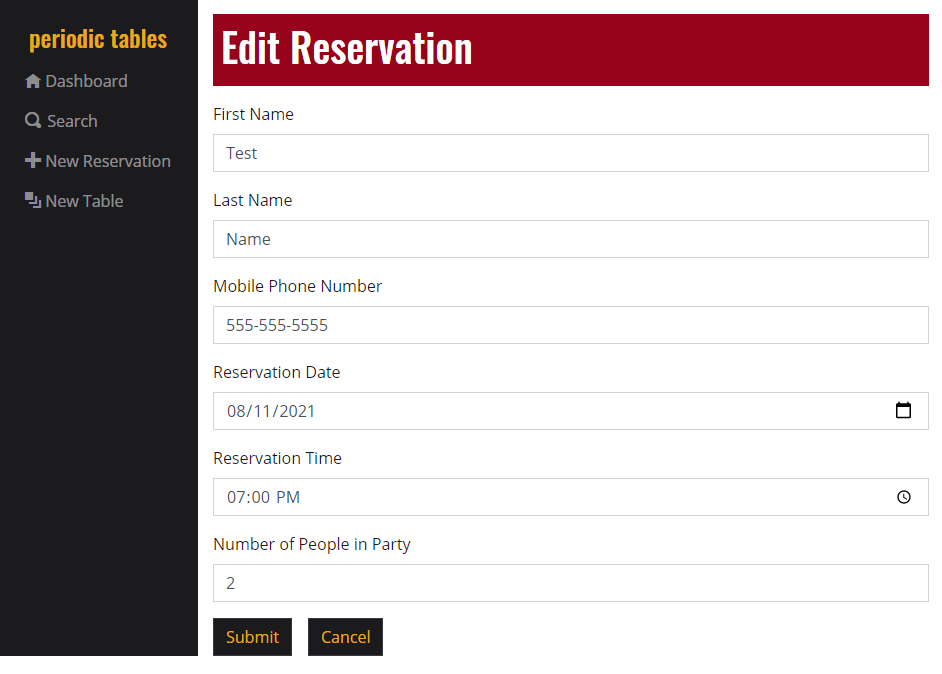

---

### Cancelling a Reservation

1. Click `cancel` on the reservation you'd like to cancel.
1. Click `OK` on the confirmation window that pops-up.

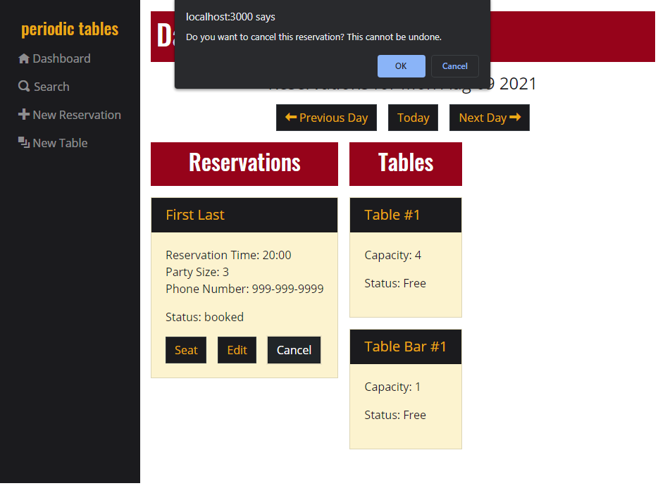

Note: cancelled reservations no longer display in the dashboard.

---

## Installation

1. Fork and clone this repository.
1. Run `cp ./back-end/.env.sample ./back-end/.env`.
1. Update the `./back-end/.env` file with the connection URL's to your database instance.
1. Run `cp ./front-end/.env.sample ./front-end/.env`.
1. Include your backend connection within `./front-end/.env` (defaults to `http://localhost:5000`).
1. Run `npm install` to install project dependencies.
1. Run `npm run start` to start the server.

If you have trouble getting the server to run, reach out for assistance.

